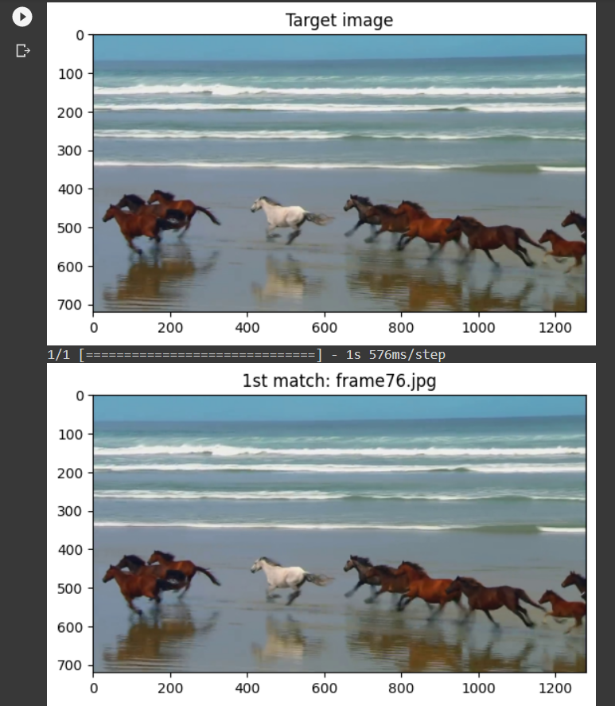
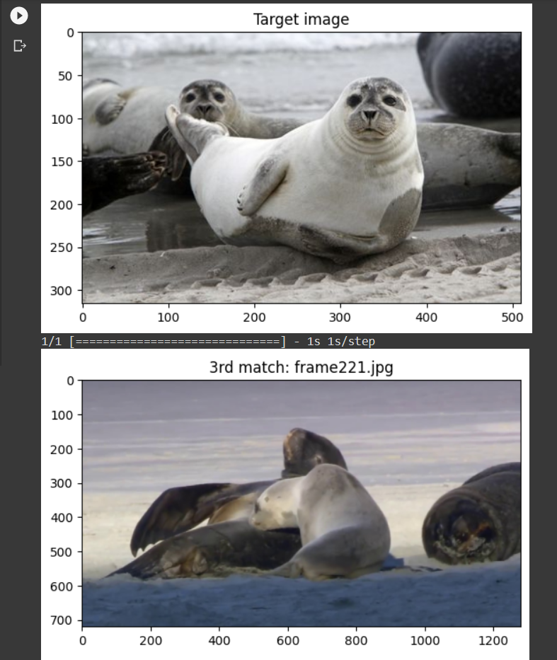
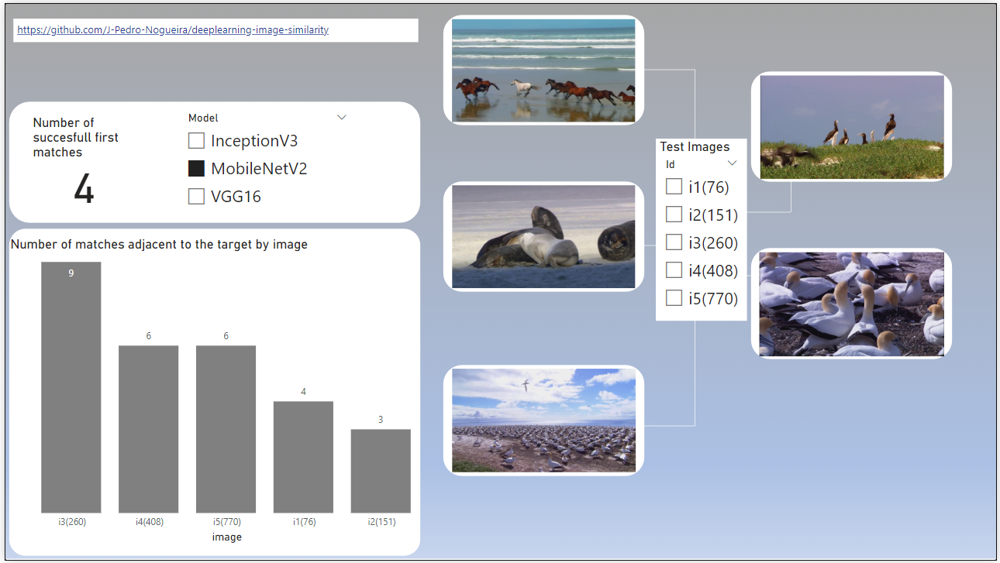

# deeplearning-image-similarity

This project presents an efficient solution for finding images similar to a given example, harnessing the power of Convolutional Neural Networks (CNNs) pre-trained on an eclectic set of images (ImageNet).

# Key Features

## Python-based Implementation
The entire project is implemented in Python, leveraging popular libraries such as TensorFlow and Keras for deep learning tasks. Python's versatility allows for easy integration with existing data analysis and machine learning workflows.

## Efficient Image Retrieval 
This method utilizes the features extracted from the pre-trained CNN to efficiently find images within the dataset that are visually similar to the query image. This process rests on the efficient comparison of feature-vectors (by minimizing the distance between tensors), and is optimized for speed and accuracy.

## Pre-trained CNNs
One of the core features of this project is the utilization of pre-trained CNNs. Instead of training a neural network from scratch — which can be computationally expensive and require a large dataset — the employed models have been pre-trained on massive datasets (ImageNet). This significantly reduces the computational requirements and enables the project to be deployed effectively even on small datasets.

## Execution on Google Colaboratory
**Google Colaboratory** provides a cloud-based Jupyter notebook environment with access to free GPU resources. This allows users to experiment with this project without the need for specialized hardware.

# How it works

- 1) Paths are defined for the input and output.
	> A sample video is suplied, along with the option to build a dataset from the extracted video-frames.

- 2) Features are extracted from every image in the dataset.
- 3) The collection of features is compared to every example image, and the results are ranked accordingly.
- 4) The pairs with the highest scores are saved for analysis.

## Example output

The program excels at finding exact matches in a dataset.

It can also be used to find simillar images, even with differing resolutions.

## Notes

- Although the .ipynb file makes use of the VGG16 architecture, this method is compatible with several CNN's. Altering the architecture can improve the results on a specific dataset: a simple **PowerBI** dashboard showing the results of changing the CNN on the sample data is also available.

